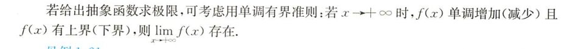
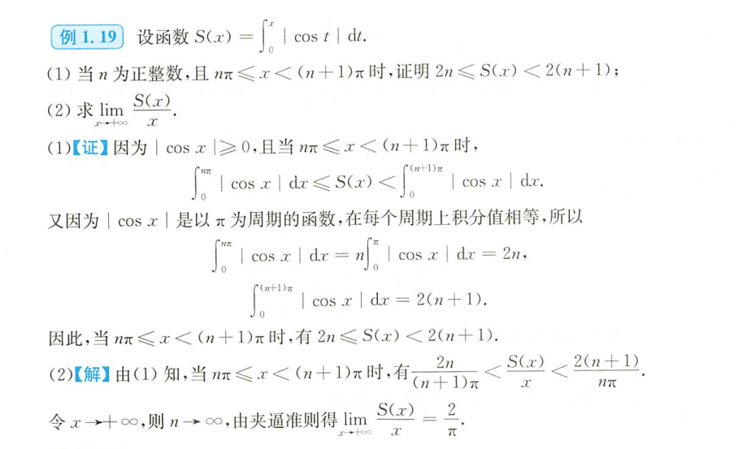
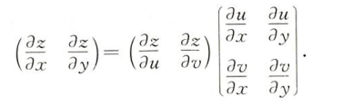

+ 

​	如给出抽象函数求极限，可考虑用单调有界准则：若$x \rightarrow +\infty$ 时，$f(x)$ 单调增加（减少）且$f(x)$ 有上界（下界），则$\lim\limits_{x \rightarrow + \infty}\, f(x)$ 存在。

---

+ 

**【例1.19】**设函数$\displaystyle{S(x) = \int_0^x \left| \cos t \right| \, \mathrm{d}t}$ .

（1）当 $n$ 为正整数，且 $n\pi \leqslant x < (n+1)\pi$ 时，证明 $\displaystyle{2n \leqslant S(x) < 2(n+1)}$ ;

（2）求 $\displaystyle{\lim\limits_{x \rightarrow + \infty} \frac{S(x)}{x}}$ .

（1）**【证】**因为 $| \cos x| \geqslant 0$ ，且当 $n\pi \leqslant x < (n+1)\pi$ 时，
$$
\int_0^{n\pi} \, \left|\, \cos x \, \right| \:\mathrm{d}x \leqslant
S(x) <
\int_0^{(n+1)\pi} \, \left| \cos x \right| \, \mathrm{d}x
$$
又因为 $\left| \cos x\right|$ 是以 $\pi$ 为周期的函数，在每个周期上积分值相等，所以
$$
\int_0^{n\pi} \left| \cos x \right| \mathrm{d}x = 
\left| \cos x \right| \mathrm{d}x = 2n ,\\
\int_0^{(n+1)\pi} \left| \cos x \right| \mathrm{d}x =  2(n+1).
$$
因此，当 $n\pi \leqslant x < (n+1)\pi$ ，有 $2n \leqslant S(x) < 2(n+1)$ .

（2）**【解】**由（1）知，当 $n\pi \leqslant x < (n+1)\pi$ 时，有$\dfrac{2n}{(n+1)\pi} < \dfrac{S(x)}{x} < \dfrac{2(n+1)}{n\pi}$ .

令 $x \rightarrow +\infty$ ，则 $n \rightarrow \infty$ ，由夹逼准则得 $\lim\limits_{x \rightarrow + \infty} \dfrac{S(x)}{x} = \dfrac{2}{\pi}$ .

---

+ 

$$
\left( \frac{\partial z}{\partial x} \quad \frac{\partial z}{\partial y}  \right) = 
\left( \frac{\partial z}{\partial u} \quad \frac{\partial z}{\partial v}  \right)
\left\lgroup  
\begin{aligned}
\frac{\partial u}{\partial x} & \frac{\partial u}{\partial y} \\[8pt]
\frac{\partial v}{\partial x} & \frac{\partial v}{\partial y}
\end{aligned}
\right\rgroup
$$

---

$$
\begin{align}
\frac{\partial z}{\partial x} &= \frac{\partial z}{\partial u} \cdot \frac{\partial u}{\partial x} + \frac{\partial z}{\partial u} \cdot \frac{\partial v}{\partial x} = vu^{v-1}(2x) + u^v(\ln u)y\\
&= (x^2+y^2)^{xy}\Big[ \frac{2x^2y}{x^2+y^2} + y\ln(x^2+y^2)  \Big], \\
\frac{\partial z}{\partial y} &= \frac{\partial z}{\partial u} \cdot \frac{\partial u}{\partial y} + 
\frac{\partial z}{\partial v} \cdot \frac{\partial v}{\partial y} = vu^{v-1}(2y) + u^v(\ln u)x\\
&=(x^2+y^2)^{xy}\Big[  \frac{2xy^2}{x^2+y^2} + x\ln (x^2+y^2) \Big].

\end{align}
$$

